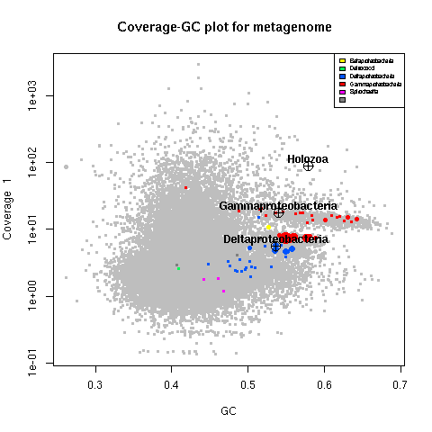
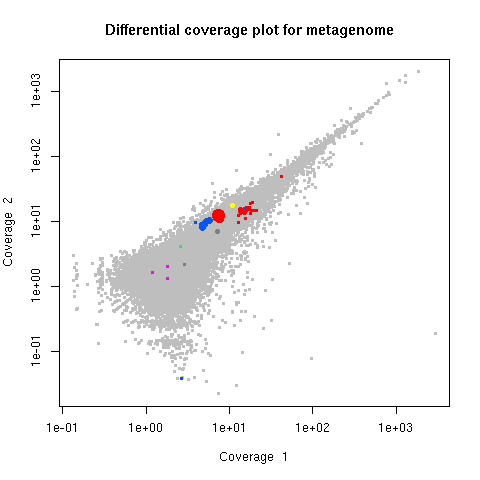
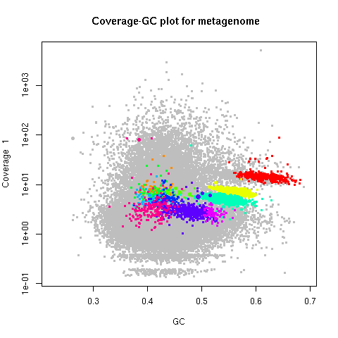

# gbtools: Interactive tools for metagenome visualization and binning in R

Refer to the [`gbtools` manual](https://github.com/kbseah/genome-bin-tools/wiki) for detailed instructions.

Read the [paper](http://journal.frontiersin.org/article/10.3389/fmicb.2015.01451/abstract) published in Frontiers in Microbiology

## Quick start

Here are the bare basics that you can do in `gbtools`, using the Olavius example data (look in the `example_data/Olavius_metagenome` folder in this package). 

The following commands are all in the R environment.

### 1. Install `gbtools`

The `tar.gz` archive can be found in the `R_source_package` folder.

```R
 > install.packages("sp") # Dependency
 > install.packages("plyr") # Dependency
 > install.packages("gbtools_2.4.5.tar.gz",repos=NULL,type="source")
```
### 2. Import data and see summary statistics

```R
 > d <- gbt (covstats=c("SampleA2.covstats","SampleG1.covstats"), # Coverage data
 +           ssu="olavius_metagenome.ssu.tab", # SSU gene annotations
 +           mark=c("amphora2_results.tab","blobology_results.tab"), # Marker genes
 +           marksource=c("amphora2","blob")) # Names for the marker gene sets
```

See summary stats by typing name of the `gbt` object

```R
 > d
 > summary (d) # same thing
```

### 3. Plot coverage vs. GC

```R 
 > plot (d, # Plots the first set of coverage data by default
 +       ssu=TRUE, # Annotate SSU genes with crosshairs
 +       textlabels=TRUE, # Add labels for SSU genes
 +       legend=TRUE) # Add legend for marker genes
```



### 4. Plot differential coverage

```R
 > plot (d, slice=c(1,2)) # Plot one set of coverage data vs. another
```



### 5. Interactively select bins from plot

```R
 > plot (d,slice=1,marker=FALSE) # Turn off color overlays
 > d.bin1 <- choosebin (d, slice=1) # Click on the plot to define the region you want
 > summary(d.bin1) # Summarize the newly-created bin
 > points(d.bin1, slice=1) # Overlay the new bin on your plot
```

### 6. Import bins from 3rd party tools and plot them

```R
 > d.metabat_bins <- importBins (d, file="metabat_bins")
 > multiBinPlot (d, bins=d.metabat_bins)
```



Each bin gets plotted in a different color

## Getting help

Documentation for each function can be accessed in R by typing `?` followed by function name at the command line (the gbtools `plot` function is filed under `plot.gbt` to distinguish it from the generic plot function).

Problems with using `gbtools`? Create a new issue using the GitHub issue-tracker on the right. Or send me an email, with "gbtools help" in the subject line.

Problems with input file formats? Read [the appendix](Appendix.\ Input\ file\ formats) and use the `input_validator.pl` script to check your input files.

## Citations 

Citation:
Seah BK and Gruber-Vodicka HR (2015). gbtools: Interactive visualization of metagenome bins in R. Front. Microbiol. 6:1451. [doi: 10.3389/fmicb.2015.01451](http://journal.frontiersin.org/article/10.3389/fmicb.2015.01451/abstract)

Cite dependencies if you use them:
* **R** -  R Core Team. 2014. R: A language and environment for statistical computing. R Foundation for Statistical Computing, Vienna, Austria. (http://www.R-project.org/)
* **BBMap** - Bushnell B. 2015. BBMap (http://sourceforge.net/projects/bbmap/)
* **AMPHORA2** - Wu M, Scott AJ. 2012. Bioinformatics 28 (7) : 1033-1034.
* **barrnap** - Seemann T. 2014. barrnap (http://www.vicbioinformatics.com/software.barrnap.shtml)
* **Usearch** - Edgar RC 2010. Bioinformatics 26 (19) : 2460-2461.
* **Vsearch** - https://github.com/torognes/vsearch
* **ARB-SILVA** - Quast C et al. 2013. Nucleic Acids Research 41 (D1) : D590-D596.
* **tRNAscan-SE** - Lowe T, Eddy S. 1997. Nucleic Acids Research 25 : 955-964.
* **Blobology** - Kumar S et al. 2013. Frontiers in Genetics 4 : 237

Contact: Brandon Seah (`kbseah@mpi-bremen.de`)
[Department of Symbiosis, Max Planck Institute for Marine Microbiology](http://www.mpi-bremen.de/en/Department_of_Symbiosis.html)
